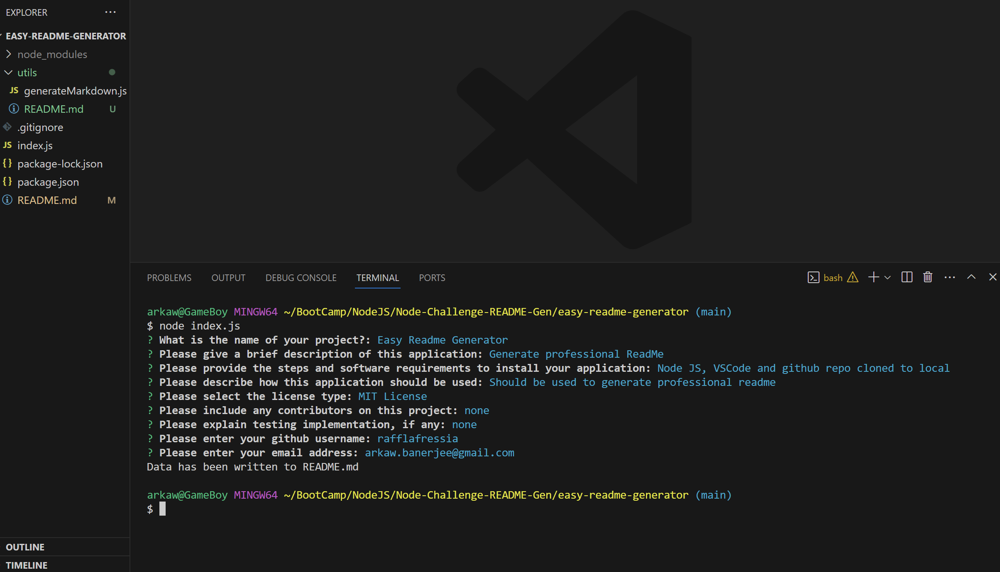
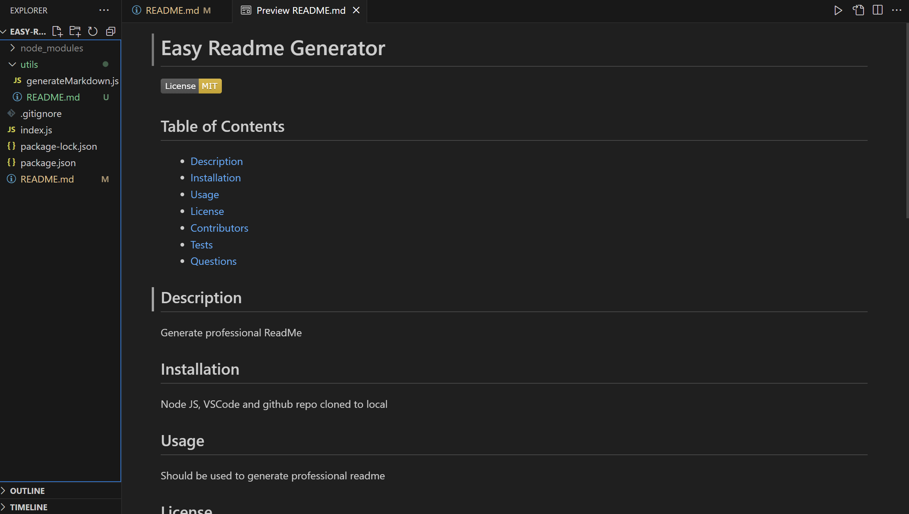

# Easy Readme Generator 

  

  ## Table of Contents
  - [Description](#description)
  - [User Story](#userstory)
  - [Installation](#installation)
  - [Usage](#usage)
  - [License](#license)
  - [Contributors](#contributors)
  - [Tests](#tests)
  - [Questions](#questions) 

  ## Description
  A Readme generator for easy professional looking markdown files.

  ## User Story
  AS A developer
  I WANT a README generator
  SO THAT I can quickly create a professional README for a new project

  ## Acceptance Criteria
  GIVEN a command-line application that accepts user input
  WHEN I am prompted for information about my application repository
  THEN a high-quality, professional README.md is generated with the title of my project and sections entitled Description, Table of Contents, Installation, Usage, License, Contributing, Tests, and Questions
  WHEN I enter my project title
  THEN this is displayed as the title of the README
  WHEN I enter a description, installation instructions, usage information, contribution guidelines, and test instructions
  THEN this information is added to the sections of the README entitled Description, Installation, Usage, Contributing, and Tests
  WHEN I choose a license for my application from a list of options
  THEN a badge for that license is added near the top of the README and a notice is added to the section of the README entitled License that explains which license the application is covered under
  WHEN I enter my GitHub username
  THEN this is added to the section of the README entitled Questions, with a link to my GitHub profile
  WHEN I enter my email address
  THEN this is added to the section of the README entitled Questions, with instructions on how to reach me with additional questions
  WHEN I click on the links in the Table of Contents
  THEN I am taken to the corresponding section of the README

  ## Deployment
  Video Link: https://youtu.be/H_cQCKqsj6s
  GitHub Repo: https://github.com/Rafflafressia/easy-readme-generator

  ## Screenshot
  

  

  ## Installation
  Node.Js installed, vscode installed and the repository cloned onto local system

  ## Usage
  It should be used to generate a professional looking markdown file. 

  ## License
  [MIT License](https://opensource.org/licenses/MIT) for more information.
    

  ## Contributors
  No contributors to this project

  ## Tests
  no testing

  ## Questions
  For more details please see GitHub repository https://github.com/rafflafressia. 
  To reach out to me directly, please contact me at arkaw.banerjee@gmail.com.
 